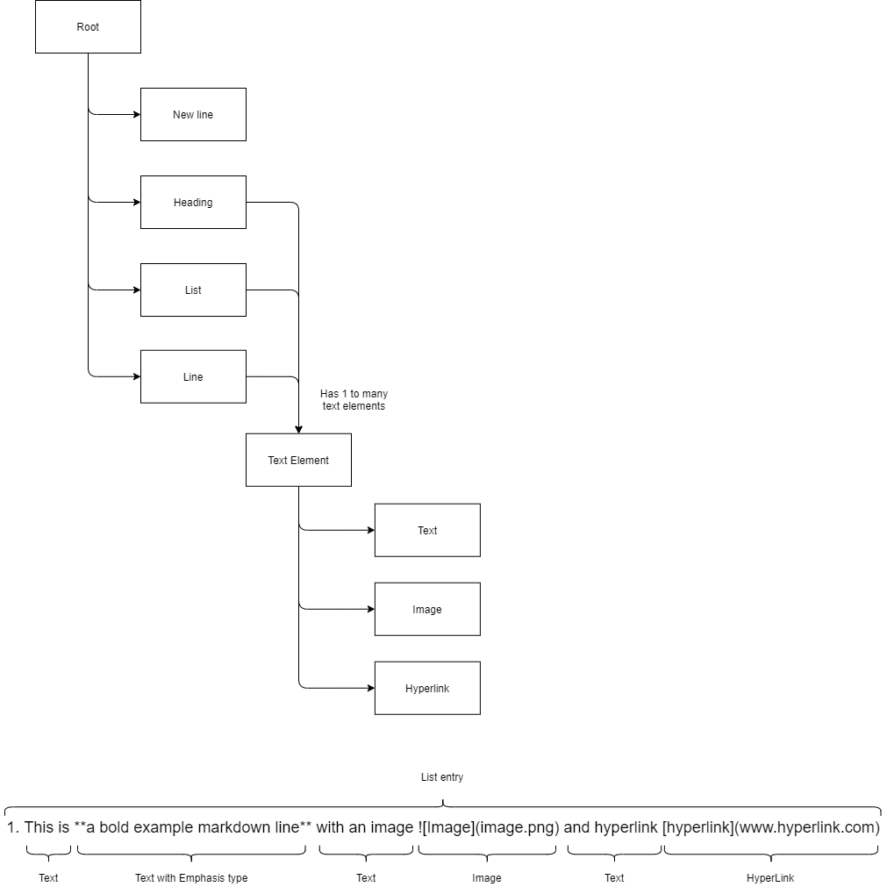

# Markdown magic

Markdown magic is markdown parser that will transform a page into a markdown Abstract Syntax Tree.

## The Markdown Syntax Tree

## Backlog

The backlog is not in particular order of importance.

- Parse markdown page into a simple page (no bold, italic, img, etc.)
- publish pdf based on AST
- Add support for hyperlinks
- Add support for images
- Add support for bold, italic
- Add support for font information (to transform font in the output file)
- Add support for tables
- Add support for inline code `val code = true`
- Add support for code blocks